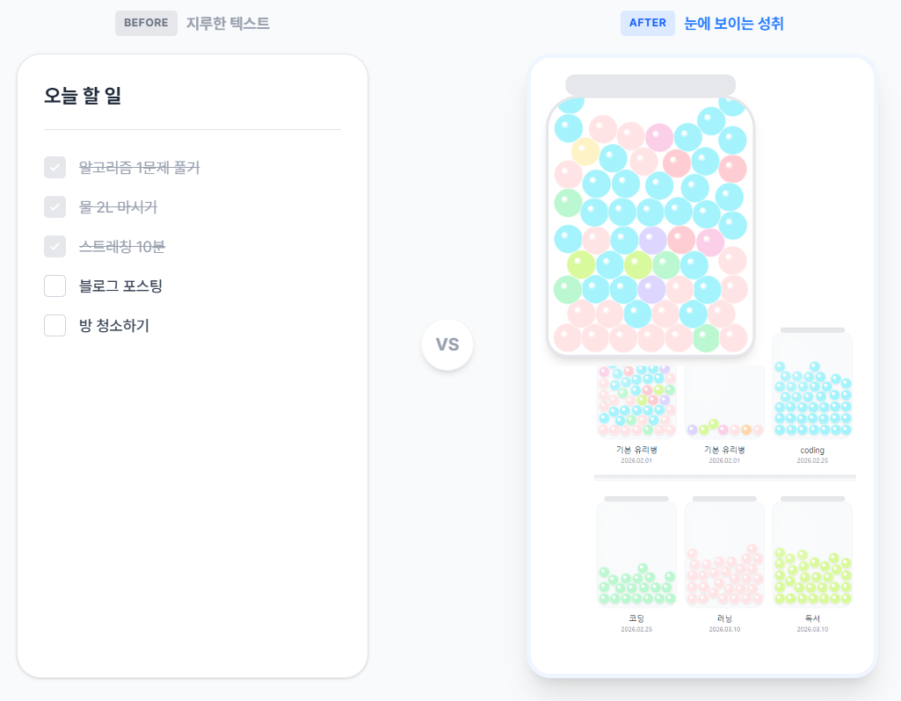

# 하루마블 — 성취감을 채우는 유리병

> **"오늘 한 일을 구슬로 만들어, 유리병을 채워보세요."**
>
> 텍스트뿐인 투두리스트에 유리구슬로 시각적 성취감을 선사하는 Done List 서비스

<br>

## Key Features

| 기능                       | 설명                                                                               |
| -------------------------- | ---------------------------------------------------------------------------------- |
| **물리 기반 인터랙션**     | 완료한 일을 입력하면 구슬이 생성되어 유리병 안에 실제처럼 떨어지고 쌓입니다.       |
| **자주 하는 일 (선반)**    | 반복적으로 완료하는 항목을 선반에 등록해두고 한 번에 여러 개를 추가할 수 있습니다. |
| **유리병 컬렉션**          | 여러 개의 유리병을 만들어 주제별로 성취를 분류하고 관리할 수 있습니다.             |
| **구슬 색상 커스터마이징** | 원하는 색상의 구슬을 선택해 나만의 유리병을 꾸밀 수 있습니다.                      |
| **완료 기록 보기**         | 유리병에 담긴 구슬을 클릭하거나 기록 모달에서 텍스트와 시간을 확인할 수 있습니다.  |
| **이메일 인증 회원가입**   | Supabase 이메일 인증 플로우를 통해 안전하게 가입할 수 있습니다.                    |
| **소셜 로그인**            | 카카오, Google OAuth로 간편하게 로그인할 수 있습니다.                              |
| **모바일 최적화 레이아웃** | 모바일 환경에 최적화된 UI를 제공합니다.                                            |


<br>

## Tech Stack

### Frontend

| 기술                          | 설명                     |
| ----------------------------- | ------------------------ |
| **React 19** + **TypeScript** | 프레임워크 / 타입 안전성 |
| **Vite 7**                    | 빌드 도구                |
| **Matter.js**                 | 2D 물리 엔진             |
| **Tailwind CSS 4**            | 유틸리티 기반 스타일링   |
| **React Router DOM 7**        | 클라이언트 사이드 라우팅 |
| **React Helmet Async**        | SEO 메타 태그 관리       |
| **Lucide React**              | 아이콘 라이브러리        |
| **Vitest**                    | 테스트 프레임워크        |

### Backend (BaaS)

| 기술         | 설명                                          |
| ------------ | --------------------------------------------- |
| **Supabase** | PostgreSQL DB, 인증(이메일/OAuth), 실시간 API |

별도의 백엔드 서버 없이 Supabase를 통해 모든 데이터 저장 및 인증을 처리합니다.

<br>

## Getting Started

### 사전 요구사항

- **Node.js** 18+
- **Supabase** 프로젝트 (무료 플랜 사용 가능)

### 1. 레포지토리 클론

```bash
git clone https://github.com/duseh729/haru-marble.git
cd haru-marble
```

### 2. 의존성 설치

```bash
yarn install
```

### 3. 환경변수 설정

`.env` 파일을 생성하고 Supabase 프로젝트의 값을 입력합니다.

```env
VITE_SUPABASE_URL=https://xxxx.supabase.co
VITE_SUPABASE_ANON_KEY=your-anon-key
```

### 4. 개발 서버 실행

```bash
yarn dev
```

<br>

## License

This project is open source and available under the [MIT License](LICENSE).
